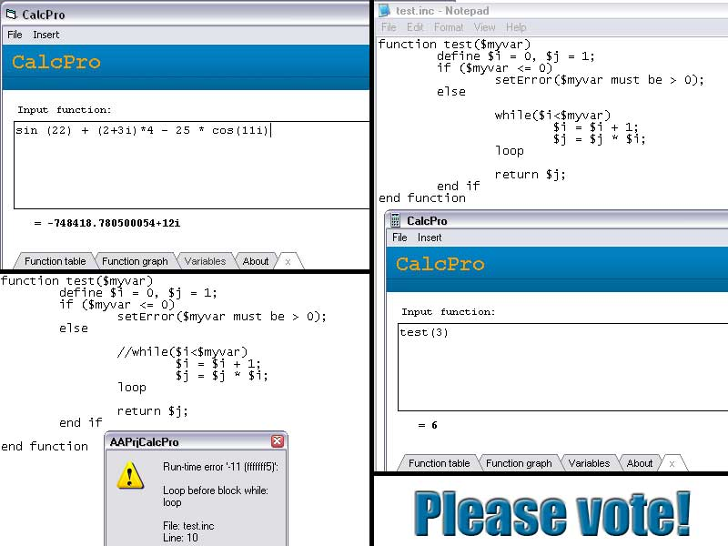



## CalcPro

### Description

This is cool and powerful function evaluator. This evaluator can evaluate any function, support complex numbers, contain own programming language (see screenshot) so you can make your own functions, can detect sintax errors, errors in input formula and much more.

There is also much integrated functions (special functions like bessel, airy..., trigonometric functions, log functions and more), you can draw function graph, print function table and much much more.

This code contain few classes and modules , so you can copy that classes and modules in your project and use these abilities in your project.

I'm spent a much much and much time for developing this, debugging, testing, searching for algorithms for some functions, working on this programming language, so please if you think this is good peace of code, please vote. Sorry for my English. THANK YOU!
 
### More Info
 

             |
---                |---
**Submitted On**   |2007-11-09 19:27:30
**By**             |[ivan stimac](https://github.com/Planet-Source-Code/PSCIndex/blob/master/ByAuthor/ivan-stimac.md)
**Level**          |Advanced
**User Rating**    |4.8 (24 globes from 5 users)
**Compatibility**  |VB 6\.0
**Category**       |[Math/ Dates](https://github.com/Planet-Source-Code/PSCIndex/blob/master/ByCategory/math-dates__1-37.md)
**World**          |[Visual Basic](https://github.com/Planet-Source-Code/PSCIndex/blob/master/ByWorld/visual-basic.md)
**Archive File**   |[CalcPro209654182008\.zip](https://github.com/Planet-Source-Code/ivan-stimac-calcpro__1-69882/archive/master.zip)

